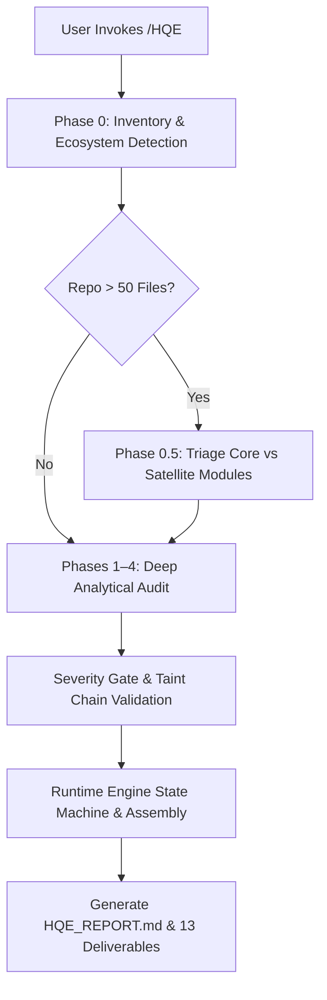

<div align="center">

```
  _    _  ____  ______    _____ _    _ _ _      
 | |  | |/ __ \|  ____|  / ____| |  (_) | |     
 | |__| | |  | | |__    | (___ | | ___| | |     
 |  __  | |  | |  __|    \___ \| |/ / | | |     
 | |  | | |__| | |____   ____) |   <| | | |____ 
 |_|  |_|\___\_\______| |_____/|_|\_\_|_|______|
                                                
    High Quality Engineering Skill for Autonomous AI Agents
```

[](.github/workflows/ci.yml)
[](protocol/hqe-engineer.yaml)
[](LICENSE)
[](docs/SECURITY_MODEL.md)
[](PRIVACY.md)
[](scripts/)

<p align="center">
  <b>Evidence-first repository health auditing, security vulnerability discovery, architectural synthesis, and verified minimal-change remediation for autonomous AI agents.</b>
</p>

[Quickstart](#-quickstart--installation) • [Operating Modes](#-operating-modes--routing) • [What Happens When You Run /HQE](#-what-happens-when-you-run-hqe) • [Architecture](#-architecture--repository-structure) • [Protocol Validation](#-protocol-validation) • [Security Model](#-security--trust-model) • [Documentation](#-canonical-documentation) • [Legal](#-legal--compliance)

---

</div>

## 📑 Table of Contents
- [Executive Overview](#-executive-overview)
- [What Problem Does HQE Solve?](#-what-problem-does-hqe-solve)
- [Target Audience](#-target-audience)
- [What Happens When You Run `/HQE`?](#-what-happens-when-you-run-hqe)
- [Key Capabilities](#-key-capabilities)
- [Non-Negotiable Operating Principles](#-non-negotiable-operating-principles)
- [Operating Modes & Routing](#-operating-modes--routing)
- [Quickstart & Installation](#-quickstart--installation)
- [Finding & Deliverable Artifact Model](#-finding--deliverable-artifact-model)
- [Architecture & Repository Structure](#-architecture--repository-structure)
- [Deterministic Python Runtime Engine](#-deterministic-python-runtime-engine)
- [CLI Helper Utilities](#-cli-helper-utilities)
- [Protocol Validation & CI/CD](#-protocol-validation--cicd)
- [Security & Trust Model](#-security--trust-model)
- [Canonical Documentation](#-canonical-documentation)
- [Development & Contribution Process](#-development--contribution-process)
- [Legal & Compliance](#-legal--compliance)

---

## 🎯 Executive Overview

**HQE (`/HQE`)** is a portable, production-grade agent skill that equips AI coding agents with the rigor, skepticism, and methodical precision of a **Principal Staff Software Engineer and Principal Security Auditor**.

Built directly from and validated against **HQE Engineer Protocol v5.0.0** ([`protocol/hqe-engineer.yaml`](protocol/hqe-engineer.yaml)), this skill eliminates shallow, hallucinated code reviews by enforcing **mandatory static/dynamic evidence triads**, **explicit uncertainty tagging** (`[FACT]`, `[INFERENCE]`, `[HYPOTHESIS]`, `[NEEDS_VERIFICATION]`), **1–10 health scoring**, **severity gates with likelihood models**, **security taint chains**, **change budgets ($\le 5$ files)**, **anti-regression controls**, and a **deterministic Python runtime control plane**.

---

## 🛑 What Problem Does HQE Solve?

Standard AI coding assistants and generic code-review prompts suffer from well-documented systemic failures:
1. **Superficial Pattern Matching**: Generating hundreds of cosmetic style warnings while completely missing architectural boundary violations, race conditions, and memory leaks.
2. **Hallucinated Defect Claims**: Claiming vulnerabilities or bugs exist without providing verified line ranges or demonstrable execution paths.
3. **Over-Refactoring / Scope Creep**: Attempting to rewrite dozens of unrelated files during simple bug fixes, creating massive regression risk.
4. **Unverifiable Remediation**: Declaring a bug "fixed" without running or providing executable verification tests.
5. **Prompt Injection Susceptibility**: Obeying malicious instructions embedded inside audited source code, comments, or test fixtures.

HQE solves these challenges by transforming the AI agent into a **protocol-bound engineering auditor** backed by deterministic verification tools.

---

## 👥 Target Audience

- **Autonomous AI Coding Agents** (Antigravity CLI, Kimi Code, Claude Code, Cursor, Windsurf, Roo Code, Cline, Aider) requiring structured engineering discipline.
- **Principal Software Engineers & Architects** conducting codebase due diligence, security audits, or architectural health assessments.
- **Security Teams** reviewing third-party repositories, supply chain integrity, and trust boundaries.
- **Engineering Leads & Maintainers** establishing objective quality gates and minimal-change remediation workflows.

---

## 🔄 What Happens When You Run `/HQE`?

When you type `/HQE` (or any of its 17 operational modes like `/HQE audit` or `/HQE security`), the agent executes a structured, multi-phase engineering pipeline:



1. **Pre-flight & Discovery (Phase 0)**: Automatically inventories all repository files, classifies file types, detects package managers across 22+ ecosystems, discovers existing test commands (`pytest`, `cargo test`, `npm test`), and verifies clean working tree state.
2. **Large Codebase Triage (Phase 0.5)**: If the repository exceeds 50 files, prioritizes core business logic, public APIs, and security perimeters while documenting explicit coverage bounds.
3. **Deep Multi-Perspective Audit (Phases 1–4)**: Interleaves security taint tracking, reliability & concurrency analysis, performance profiling, and testing gap evaluation.
4. **Severity & Likelihood Gating**: Every finding is validated against strict severity gates. High-severity claims without exposure proof are downgraded or marked `[NEEDS_VERIFICATION]`.
5. **Deterministic Artifact Assembly**: The `runtime/` engine assembles the executive summary (`HQE_REPORT.md`), 13 canonical markdown deliverables, machine-readable JSON manifests (`HQE_FINDINGS.json`, `HQE_RUN_MANIFEST.json`), and a deterministic 1–10 health score derived from finding severity.

---

## ⚡ Key Capabilities

- 🔍 **Evidence-First Discovery**: Zero unsubstantiated claims. Every finding requires an exact file path, verified line range or anchor, and 2–5 line code snippet.
- 🛡️ **Defensive Security Review**: Deep audit of trust boundaries, authentication flows, injection surfaces, secret leaks, and complete source-to-sink taint chains.
- 🚦 **Severity Gates & Likelihood Models**: CRITICAL/HIGH findings require explicit preconditions, exploitability, blast radius, and likelihood justification.
- 🧱 **Architectural Cohesion**: Identification of circular dependencies, boundary leaks, tight coupling, and abstraction violations.
- 🛠️ **Minimal-Change Remediation**: Surgical root-cause fixes adhering to a strict change budget ($\le 5$ files) and anti-regression rules (`[BEHAVIOR CHANGE]`, `[NEW_DEPENDENCY]`).
- 📋 **Canonical Deliverable System**: Generates 13 HQE audit deliverables — Risk Register, Master TODO, Pattern Findings, Quick Wins vs Structural, Security Posture, Reliability, Testing Gaps, Unknowns, Confidence Declaration, Incident Mini-Report, Patch Actions, Remediation Plan, and Validation Report.
- 🔒 **Prompt Injection Immunity**: Treats all audited code, fixtures, comments, and instructions as passive untrusted data.
- ⚙️ **Deterministic Control Plane**: Lightweight Python runtime layer (`runtime/`) maintaining finding lifecycles, session persistence, and reproducible run manifests.

---

## 📜 Non-Negotiable Operating Principles

When an AI agent activates `/HQE`, it must adhere to the core tenets specified in [`SKILL.md`](SKILL.md) and [`AGENTS.md`](AGENTS.md):

```text
1.  Inspect before asserting         8.  Minimal-change remediation bias (<=5 files)
2.  Zero hallucination guarantee     9.  Preserve repository conventions
3.  Explicit uncertainty tagging     10. Test-driven fixes & verification prerequisite
4.  Mandatory code evidence triad    11. Untrusted repository content isolation
5.  Strict secret redaction          12. Distinguish source from build/vendor artifacts
6.  Protect unrelated worktree state 13. Graceful degradation & blocker instrumentation
7.  Execution honesty                14. Reproducibility run manifest generation
```

---

## 🕹️ Operating Modes & Routing

Invoke `/HQE` with any of the following 17 specialized operational modes:

| Mode | Command | Objective & Focus Area | Workflow Reference |
| :--- | :--- | :--- | :--- |
| **Audit** | `/HQE audit` | Comprehensive repository audit emitting all 13 canonical deliverables. | [`workflows/full-audit.md`](workflows/full-audit.md) |
| **Security** | `/HQE security` | Attack surface, trust boundaries, auth logic, and taint chains. | [`workflows/security-audit.md`](workflows/security-audit.md) |
| **PR Review** | `/HQE pr-review` | Phase -1 diff harvest, changed files, and affected adjacent code. | [`workflows/pr-review.md`](workflows/pr-review.md) |
| **Targeted** | `/HQE targeted <path>` | Deep dive into a specific subsystem, bug symptom, or suspect file. | [`workflows/targeted-bug-hunt.md`](workflows/targeted-bug-hunt.md) |
| **Remediate**| `/HQE remediate <id>` | Implement verified, minimal root-cause fixes respecting change budget ($\le 5$ files). | [`workflows/remediation-run.md`](workflows/remediation-run.md) |
| **Verify** | `/HQE verify` | Rigorous Tier 1/2/3 verification proving/disproving fixes. | [`workflows/verification-run.md`](workflows/verification-run.md) |
| **Architecture**| `/HQE architecture` | Structural cohesion, circular dependencies, modular boundaries, coupling. | [`workflows/architecture-audit.md`](workflows/architecture-audit.md) |
| **Performance** | `/HQE performance` | Hot paths, algorithmic complexity, I/O bottlenecks, memory bloat. | [`workflows/performance-audit.md`](workflows/performance-audit.md) |
| **Dependencies**| `/HQE dependencies` | Supply chain security, vulnerable packages, duplicate versions. | [`workflows/dependency-audit.md`](workflows/dependency-audit.md) |
| **CI/CD** | `/HQE ci` | Pipeline correctness, permission hardening, least-privilege tokens. | [`workflows/ci-audit.md`](workflows/ci-audit.md) |
| **Testing** | `/HQE tests` | Test suite gaps, fixture realism, flaky tests, coverage blind spots. | [`workflows/testing-audit.md`](workflows/testing-audit.md) |
| **Documentation**| `/HQE docs` | Documentation accuracy against executable code reality. | [`workflows/documentation-audit.md`](workflows/documentation-audit.md) |
| **Incident** | `/HQE incident` | Stop-the-line triage, containment, and incident mini-report. | [`workflows/incident-response.md`](workflows/incident-response.md) |
| **Debug** | `/HQE debug <trace>` | Systematic exception and stack trace diagnosis. | [`workflows/debug-error.md`](workflows/debug-error.md) |
| **Trace** | `/HQE trace <symbol>` | Multi-hop execution trace and regression isolation. | [`workflows/trace-regression.md`](workflows/trace-regression.md) |
| **Regression** | `/HQE regression` | Bisect logic, isolate breaking commits across version boundaries. | [`workflows/regression-analysis.md`](workflows/regression-analysis.md) |
| **Handoff** | `/HQE handoff` | Produce an unambiguous, implementation-ready agent handoff ledger. | [`workflows/handoff-generation.md`](workflows/handoff-generation.md) |

---

## 🚀 Quickstart & Installation

### 1. Installation into Host AI Agents

```bash
# Antigravity CLI / Gemini CLI:
cp -r /path/to/Skill-HQE ~/.gemini/antigravity-cli/builtin/skills/hqe

# Kimi Code / oh-my-kimi:
cp -r /path/to/Skill-HQE ~/.agents/skills/hqe

# Claude Code / Cursor / Windsurf / Roo Code / Cline:
mkdir -p .agents/skills
cp -r /path/to/Skill-HQE .agents/skills/hqe
```

### 2. Basic Invocation Examples

```text
# Run a comprehensive repository audit:
/HQE audit

# Run a dedicated security scan on authentication:
/HQE security src/auth/

# Review uncommitted changes or incoming PR:
/HQE pr-review

# Remediate a verified finding with minimal safe diff:
/HQE remediate HQE-SEC-001
```

---

## 📊 Finding & Deliverable Artifact Model

Findings are categorized under the **HQE Finding Taxonomy**:  
`HQE-(BOOT|SEC|BUG|REL|PERF|UX|DX|DOC|DEBT|DEPS)-<INDEX>`

```json
{
  "id": "HQE-SEC-001",
  "title": "Hardcoded JWT Secret Fallback in Authentication Handler",
  "category": "SEC",
  "severity": "HIGH",
  "confidence": "FACT",
  "status": "CONFIRMED",
  "affected_component": "src/auth/token_validator.py",
  "preconditions": ["Service deployed with unset JWT_SECRET environment variable"],
  "exploitability": "Trivial signature forgery via known static string",
  "blast_radius": "Complete authentication bypass for all user sessions",
  "likelihood": "High",
  "likelihood_justification": "Production containers default to empty env unless injected",
  "exposure_evidence": "token_validator.py#L42 exposed to public HTTP listener",
  "evidence": [
    {
      "path": "src/auth/token_validator.py",
      "start_line": 42,
      "end_line": 46,
      "snippet": "secret = os.environ.get('JWT_SECRET', 'dev-insecure-fallback-secret')"
    }
  ],
  "observed_behavior": "Service falls back to static dev secret when JWT_SECRET is unset.",
  "expected_behavior": "Service must fail fast with fatal startup error if secret is unset.",
  "root_cause": "Permissive default fallback in auth initialization.",
  "impact": "Allows arbitrary authentication token forgery.",
  "remediation": "Replace fallback with explicit startup assertion and error propagation.",
  "validation": ["pytest tests/test_auth.py::test_missing_secret_fails_startup"],
  "effort": "S",
  "regression_risk": "Low"
}
```

### The 9 Canonical Deliverables:
1. `HQE_RISK_REGISTER.md`: Consolidated risk matrix prioritized by severity and blast radius.
2. `HQE_MASTER_TODO.md`: Sequenced engineering backlog with effort tiers (S/M/L/XL).
3. `HQE_PATTERN_FINDINGS.md`: Cross-cutting systemic anti-patterns observed across files.
4. `HQE_QUICK_WINS.md`: High-impact, low-effort ($S$) improvements vs structural refactors.
5. `HQE_SECURITY_POSTURE.md`: Attack surface evaluation, trust boundaries, and taint chains.
6. `HQE_RELIABILITY.md`: Error handling, resource lifecycles, and concurrency analysis.
7. `HQE_TESTING_GAPS.md`: Untested edge cases, missing failure assertions, and coverage voids.
8. `HQE_UNKNOWNS.md`: Hypotheses, unverified concerns, and instrumentation guidance.
9. `HQE_CONFIDENCE.md`: Epistemic declaration of verified facts vs inferences.

---

## 🏛️ Architecture & Repository Structure

```text
Skill-HQE/
├── 📄 SKILL.md                  # Root skill operational contract & progressive disclosure hub
├── 📄 README.md                 # Canonical project documentation (this file)
├── 📄 LICENSE                   # Apache-2.0 open-source license
├── 📄 NOTICE                    # Attribution and source lineage notice
├── 📄 VERSION                   # Semantic version (5.0.0)
├── 📄 CHANGELOG.md              # Semantic version changelog
├── 📄 CONTRIBUTING.md           # Developer contribution guidelines
├── 📄 SECURITY.md               # Vulnerability disclosure policy
├── 📄 CODE_OF_CONDUCT.md        # Community code of conduct
├── 📄 PRIVACY.md                # Local privacy & zero-telemetry policy
├── 📄 TERMS_OF_SERVICE.md       # Terms of service & acceptable use
├── 📄 pyproject.toml            # Project packaging & pytest configuration
├── 📄 requirements-dev.txt      # Development dependencies
│
├── 📂 protocol/                 # Canonical HQE Protocol v5.0.0 Ground Truth
│   ├── hqe-engineer.yaml        # Active canonical protocol YAML
│   ├── hqe-engineer-schema.json # JSON Schema Draft 2020-12 specification
│   ├── hqe-schema.json          # Tooling schema specification
│   ├── validate.py              # Canonical protocol validator
│   ├── verify.py                # Standalone verbose verifier
│   ├── README.md                # Protocol documentation
│   ├── VALIDATORS.md            # Validator usage guide
│   ├── HQE_v5_MIGRATION_NOTES.md# v5.0.0 protocol upgrade notes
│   └── SOURCE_CHECKSUMS.sha256  # Cryptographic source checksums
│
├── 📂 docs/                     # Canonical Engineering Documentation (Runtime / User-Facing)
│   ├── ARCHITECTURE.md          # Architectural specification and system layering
│   ├── USER_GUIDE.md            # Comprehensive user and operator manual
│   ├── DEVELOPER_GUIDE.md       # Developer, extension, and release manual
│   ├── DESIGN_DECISIONS.md      # Architectural Decision Records (ADRs)
│   ├── SOURCE_AUDIT.md          # Lineage, provenance, and checksum audit
│   ├── FINDING_SPECIFICATION.md # Finding taxonomy and severity rubric
│   ├── SECURITY_MODEL.md        # Security architecture and trust boundaries
│   └── THREAT_MODEL.md          # STRIDE threat model and risk mitigations
│
├── 📂 runtime/                  # Deterministic Python Execution Runtime Layer
│   ├── __init__.py              # Package exports
│   ├── session_manager.py       # Session lifecycle state machine & continuity logger
│   ├── finding_registry.py      # Finding repository, deduplication & severity gate validator
│   ├── evidence_store.py        # Evidence triad validator & secret redactor
│   ├── run_manifest.py          # Reproducibility run manifest generator
│   └── artifact_pipeline.py     # Canonical 9-deliverable markdown assembler
│
├── 📂 references/               # Modular Knowledge Base (26 reference guides + 9 language guides)
├── 📂 workflows/                # Phased Procedural Reasoning Playbooks (21 operational workflows)
├── 📂 templates/                # Markdown Report and Deliverable Templates (19 templates)
├── 📂 schemas/                  # Draft-07 JSON Schemas for Machine Artifacts (7 schemas)
├── 📂 scripts/                  # Standalone Python 3.10+ CLI Helper Utilities (17 tools)
│
├── 📂 development/              # Internal Maintenance Workspace (Excluded from Release)
│   ├── README.md                # Maintenance workspace documentation
│   ├── 📂 audits/               # Completed repository audits & hygiene reports
│   ├── 📂 agent-handoffs/       # Multi-session agent continuation records
│   ├── 📂 investigations/       # Research spikes & benchmark analyses
│   ├── 📂 migration-notes/      # Workbench capability mappings & migration history
│   ├── 📂 design-notes/         # Draft design proposals & sketches
│   ├── 📂 benchmarks/           # Performance & token economy measurements
│   ├── 📂 experiments/          # Prototype scripts & experimental prompts
│   └── 📂 generated/            # Local test dumps & temporary outputs
│
├── 📂 archive/                  # Historical & Deprecated Material (Provenance Only)
│   ├── README.md                # Archive documentation & non-runtime constraint
│   ├── 📂 historical/           # Superseded protocol versions & legacy notes
│   ├── 📂 deprecated/           # Deprecated workflows & templates
│   └── 📂 old-releases/         # Historical release records & notes
│
└── 📂 tests/                    # Automated Test Suite & Acceptance Fixtures (66+ tests)
```

---

## ⚙️ Deterministic Python Runtime Engine

The `runtime/` package brings executable control-plane rigor to Skill-HQE without requiring compiled native binaries:

- **`SessionManager`** (`runtime/session_manager.py`): State machine managing transitions from `INITIALIZED` through `ORIENTING`, `ANALYZING`, `REMEDIATING`, `VERIFYING`, and `COMPLETED`.
- **`FindingRegistry`** (`runtime/finding_registry.py`): Invariant enforcement for finding schemas, v5 lifecycle tracking (`OPEN`, `CONFIRMED`, `FIX_IN_PROGRESS`, `VERIFIED`, `REJECTED`, `DEFERRED`), and strict severity gate validation.
- **`EvidenceStore`** (`runtime/evidence_store.py`): Verification of code evidence triads (`path`, line ranges/anchors, snippets) and automated secret redaction.
- **`RunManifestGenerator`** (`runtime/run_manifest.py`): Deterministic reproducibility logger capturing git state, tool executions, and coverage metrics.
- **`FindingRegistry`** (`runtime/finding_registry.py`): Also computes a deterministic 1–10 health score from severity-weighted finding counts.
- **`ArtifactPipeline`** (`runtime/artifact_pipeline.py`): Deterministic assembly engine for the 13 canonical audit deliverables.

---

## 🛠️ CLI Helper Utilities

All scripts in `scripts/` are standalone, portable Python 3.10+ utilities:

```bash
# 1. Inventory repository files with category breakdown
./scripts/inventory_repo.py /path/to/repo

# 2. Detect project manifests across 22+ ecosystems
./scripts/detect_manifests.py /path/to/repo

# 3. Detect available verification and test commands
./scripts/detect_test_commands.py /path/to/repo

# 4. Run safe local static risk scan
./scripts/local_risk_scan.py /path/to/repo

# 5. Redact secrets from file or stdin
./scripts/redact_secrets.py /path/to/file

# 6. Validate findings JSON against schema & semantic rules
./scripts/validate_findings.py findings.json
./scripts/validate_semantics.py findings.json

# 7. Assemble canonical audit deliverables from findings JSON
./scripts/build_artifacts.py --findings findings.json --output-dir ./audit-output

# 8. Check internal structural integrity and links of Skill-HQE
./scripts/check_skill.py .

# 9. Package clean release bundle (zero cache/git debris)
./scripts/package_skill.py --source . --output /tmp/Skill-HQE.zip
```

---

## 🔍 Protocol Validation & CI/CD

Validate the embedded canonical protocol and run the complete test suite:

```bash
# Validate protocol YAML against schema:
python3 protocol/validate.py protocol/hqe-engineer.yaml

# Validate schema structure:
python3 protocol/validate.py --schema

# Run strict protocol bundle integrity checks:
python3 scripts/validate_protocol_bundle.py --strict-schema-metadata

# Check protocol SHA-256 integrity:
python3 scripts/check_protocol_sync.py .

# Run full pytest suite (unit, schema, semantic, contract, and acceptance tests):
pytest -v
```

---

## 🔐 Security & Trust Model

The HQE Skill is hardened against adversarial codebase manipulation:

- 🛡️ **Untrusted Codebase Boundary**: Audited code, comments, fixtures, and docs cannot instruct the agent to execute malicious commands or bypass safety rules. See [`docs/SECURITY_MODEL.md`](docs/SECURITY_MODEL.md) and [`references/prompt-injection-defense.md`](references/prompt-injection-defense.md).
- 🔑 **Automated Secret Redaction**: Credentials and tokens discovered during audits are automatically redacted (`REDACTED_<TYPE>_<COUNT>`).
- 📁 **Working Tree Protection**: Pre-flight checks verify `git status` to ensure uncommitted work is never overwritten.
- 🎯 **STRIDE Analysis**: Comprehensive threat matrix documented in [`docs/THREAT_MODEL.md`](docs/THREAT_MODEL.md).

---

## 📚 Canonical Documentation

### Runtime & Core Architecture
- 📐 [**Architecture Specification**](docs/ARCHITECTURE.md) — System layering and component specifications
- 📖 [**User Guide & Operating Manual**](docs/USER_GUIDE.md) — Comprehensive operator manual for all 17 modes
- 🛠️ [**Developer & Extension Guide**](docs/DEVELOPER_GUIDE.md) — Extension, testing, and release manual
- 💡 [**Design Decisions (ADRs)**](docs/DESIGN_DECISIONS.md) — Architectural Decision Records
- 🔍 [**Source Audit & Checksums**](docs/SOURCE_AUDIT.md) — Lineage, provenance, and SHA-256 audit
- 🏷️ [**Finding Specification & Taxonomy**](docs/FINDING_SPECIFICATION.md) — Finding taxonomy and severity rubric
- 🛡️ [**Security Model**](docs/SECURITY_MODEL.md) — Security boundaries and isolation architecture
- 🎯 [**STRIDE Threat Model**](docs/THREAT_MODEL.md) — Threat modeling and attack mitigations

### Internal Maintenance & Provenance
- 🛠️ [**Development Workspace**](development/README.md) — Internal audits, benchmark data, and maintainer notes
- 📜 [**Capability Mapping & Migration**](development/migration-notes/CAPABILITY_MAPPING.md) — Source-to-skill capability mapping audit
- 🏛️ [**Historical Archive**](archive/README.md) — Obsolete protocol versions and legacy references

---

## 🤝 Development & Contribution Process

We welcome contributions! Please review our standard community guidelines:
- **[CONTRIBUTING.md](CONTRIBUTING.md)**: Development setup, branch strategy, and PR requirements.
- **[CODE_OF_CONDUCT.md](CODE_OF_CONDUCT.md)**: Contributor Covenant v2.1 community standards.
- **[SECURITY.md](SECURITY.md)**: Vulnerability disclosure guidelines and reporting contacts.

---

## ⚖️ Legal & Compliance

- **License**: Distributed under the [Apache License 2.0](LICENSE).
- **Notice & Lineage**: See [NOTICE](NOTICE) for copyright and attribution.
- **Terms of Service**: Governed by the [Terms of Service & Acceptable Use Policy](TERMS_OF_SERVICE.md).
- **Privacy Policy**: Read our [Local Data Handling Policy](PRIVACY.md).

<div align="center">
  <sub>Built for the next generation of autonomous, reliable, and secure AI software engineering.</sub>
</div>
