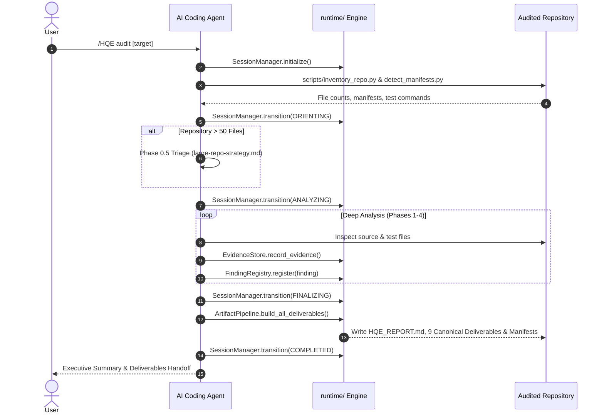

# HQE Skill Architecture & Design Specification

**Specification Version**: 5.0.0  
**Protocol Version**: HQE Engineer Protocol v5.0.0 (`protocol/hqe-engineer.yaml`)  
**Schema Standard**: JSON Schema Draft 2020-12 / Draft-07

---

## 1. System Philosophy

The **HQE (High Quality Engineering) Agent Skill** (`/HQE`) equips autonomous LLM agents with the rigor, skepticism, and methodical precision of a Principal Staff Software Engineer and Principal Security Auditor.

Unlike traditional static analysis tools that emit uncontextualized lint noise, HQE enforces:
1. **Mandatory Evidence Triads**: Every finding requires an exact file path, verified line range/anchor, and a 2–5 line code snippet.
2. **Epistemic Honesty**: Strict confidence tagging (`[FACT]`, `[INFERENCE]`, `[HYPOTHESIS]`, `[NEEDS_VERIFICATION]`).
3. **Severity & Likelihood Gating**: High-severity issues require demonstrable exposure evidence, blast-radius estimations, and explicit preconditions.
4. **Surgical Remediation Bias**: Minimal-change fixes constrained by a strict change budget ($\le 5$ files) and anti-regression rules.
5. **Deterministic Control Plane**: A lightweight Python runtime engine enforcing state machine transitions, session persistence, and canonical deliverable assembly.

---

## 2. Structural Layering & Component Decomposition

```text
Skill-HQE/
├── 📄 SKILL.md                  # Root skill operational contract & progressive disclosure hub
├── 📄 README.md                 # Canonical project manual & overview
├── 📄 LICENSE                   # Apache-2.0 open-source license
├── 📄 NOTICE                    # Attribution and source lineage notice
├── 📄 VERSION                   # Semantic version (5.0.0)
├── 📄 CHANGELOG.md              # Semantic version changelog
├── 📄 CONTRIBUTING.md           # Developer contribution guidelines
├── 📄 SECURITY.md               # Vulnerability disclosure policy
├── 📄 CODE_OF_CONDUCT.md        # Community code of conduct
├── 📄 PRIVACY.md                # Local privacy & zero-telemetry policy
├── 📄 TERMS_OF_SERVICE.md       # Terms of service & acceptable use
├── 📄 pyproject.toml            # Project packaging & pytest configuration
├── 📄 requirements-dev.txt      # Development dependencies
│
├── 📂 protocol/                 # Canonical HQE Protocol v5.0.0 Ground Truth
│   ├── hqe-engineer.yaml        # Active canonical protocol YAML
│   ├── hqe-engineer-schema.json # JSON Schema Draft 2020-12 specification
│   ├── hqe-schema.json          # Tooling schema specification
│   ├── validate.py              # Canonical protocol validator
│   ├── verify.py                # Standalone verbose verifier
│   ├── README.md                # Protocol documentation
│   ├── VALIDATORS.md            # Validator usage guide
│   ├── HQE_v5_MIGRATION_NOTES.md# v5.0.0 protocol upgrade notes
│   └── SOURCE_CHECKSUMS.sha256  # Cryptographic source checksums
│
├── 📂 docs/                     # Canonical Engineering Documentation (Runtime / User-Facing)
│   ├── ARCHITECTURE.md          # Architectural specification (this document)
│   ├── USER_GUIDE.md            # Comprehensive user and operator manual
│   ├── DEVELOPER_GUIDE.md       # Developer, extension, and release manual
│   ├── DESIGN_DECISIONS.md      # Architectural Decision Records (ADRs)
│   ├── SOURCE_AUDIT.md          # Lineage, provenance, and checksum audit
│   ├── FINDING_SPECIFICATION.md # Finding taxonomy and severity rubric
│   ├── SECURITY_MODEL.md        # Security architecture and trust boundaries
│   ├── THREAT_MODEL.md          # STRIDE threat model and risk mitigations
│   └── artifact-format.md       # Canonical artifact layout and schema contracts
│
├── 📂 runtime/                  # Deterministic Python Execution Runtime Layer
│   ├── __init__.py              # Package exports
│   ├── session_manager.py       # Session lifecycle state machine & continuity logger
│   ├── finding_registry.py      # Finding repository, deduplication & severity gate validator
│   ├── evidence_store.py        # Evidence triad validator & secret redactor
│   ├── run_manifest.py          # Reproducibility run manifest generator
│   └── artifact_pipeline.py     # Canonical markdown + JSON deliverable assembler
│
├── 📂 references/               # Modular Knowledge Base (Progressively Disclosed)
│   ├── hqe-protocol.md          # Human-readable protocol projection
│   ├── audit-methodology.md     # Multi-phase audit methodology
│   ├── evidence-standard.md     # Code snippet & evidence triad standards
│   ├── severity-confidence-effort.md # Severity gate, confidence, and effort matrix
│   ├── health-scoring.md        # Evidence-backed 1–10 health scoring
│   ├── change-control.md        # Change budget & anti-regression controls
│   ├── blockers-and-unknowns.md # No-stall instrumentation guidelines
│   ├── pre-delivery-gates.md    # Pre-delivery checklist & definition of done
│   ├── output-controls.md       # Output caps and overflow consolidation
│   ├── patch-packaging.md       # Unified diff patch packaging contract
│   ├── quality-gates.md         # Engineering evaluation gates
│   ├── reasoning-methodologies.md # 5W1H, CAGEERF, FOCUS, REACT, SCAMPER
│   ├── security-review.md       # Security review checklist & taint chains
│   ├── reliability-review.md    # Fault tolerance, retries, and race conditions
│   ├── observability-review.md  # Logging, metrics, and distributed tracing
│   ├── performance-review.md    # Hot paths, I/O bottlenecks, and complexity
│   ├── architecture-review.md   # Modularity, coupling, and boundary leaks
│   ├── testing-review.md        # Test gap analysis & fixture realism
│   ├── dependency-review.md     # Supply chain and dependency risks
│   ├── ci-cd-review.md          # Pipeline security, permissions, and gates
│   ├── documentation-review.md  # Documentation validation vs reality
│   ├── ux-dx-review.md          # CLI ergonomics, errors, and onboarding
│   ├── boot-startup-review.md   # Boot panics and environment initialization
│   ├── technical-debt-review.md # Complexity and dead code elimination
│   ├── remediation.md           # Minimal-change fix engineering
│   ├── verification.md          # Verification tiers (Tier 1/2/3)
│   ├── large-repo-strategy.md   # Triage and coverage ledger for >50 files
│   ├── prompt-injection-defense.md # Untrusted content defense rules
│   ├── source-lineage.md        # Source provenance and lineage notes
│   └── 📂 language-guides/      # Polyglot diagnostic guides (9 languages)
│
├── 📂 workflows/                # Phased Procedural Reasoning Playbooks (17+ Modes)
│   ├── full-audit.md            # End-to-end full audit playbook
│   ├── targeted-bug-hunt.md     # Focused diagnostic playbook
│   ├── security-audit.md        # Dedicated security audit playbook
│   ├── architecture-audit.md    # Architecture evaluation playbook
│   ├── performance-audit.md     # Performance audit playbook
│   ├── dependency-audit.md      # Dependency & supply chain audit
│   ├── ci-audit.md              # CI/CD pipeline audit
│   ├── testing-audit.md         # Test suite & coverage audit
│   ├── documentation-audit.md   # Documentation accuracy audit
│   ├── remediation-run.md       # Safe remediation execution playbook
│   ├── verification-run.md      # Verification & test proof playbook
│   ├── regression-analysis.md   # Regression isolation playbook
│   ├── pr-review.md             # Pull request diff analysis playbook
│   ├── incident-response.md     # Stop-the-line incident playbook
│   ├── debug-error.md           # Error & exception debugging playbook
│   ├── trace-regression.md      # Multi-hop execution trace playbook
│   ├── handoff-generation.md    # Agent-to-agent task delegation playbook
│   ├── runtime-initialization.md# Runtime engine startup playbook
│   ├── artifact-generation.md   # Deliverable pipeline assembly playbook
│   ├── evidence-capture.md      # Evidence recording & redaction playbook
│   └── final-quality-gate.md    # Pre-delivery quality gate playbook
│
├── 📂 templates/                # Markdown Report and Deliverable Templates
│   ├── finding.md               # Standard single finding template
│   ├── report.md                # Executive audit summary report
│   ├── handoff.md               # Agent handoff ledger template
│   ├── run-manifest.md          # Run manifest template
│   ├── risk-register.md         # Risk register deliverable
│   ├── master-todo-backlog.md   # Master TODO backlog deliverable
│   ├── pattern-findings.md      # Cross-cutting pattern findings deliverable
│   ├── quick-wins-vs-structural.md # Quick wins vs structural work deliverable
│   ├── security-posture-summary.md # Security posture summary deliverable
│   ├── reliability-summary.md   # Reliability summary deliverable
│   ├── testing-gaps.md          # Testing gaps deliverable
│   ├── unknowns-verification.md # Blockers & unknowns deliverable
│   ├── confidence-declaration.md# Confidence declaration deliverable
│   ├── session-log.md           # Session continuity log template
│   ├── redaction-log.md         # Redaction log template
│   ├── patch-action.md          # Single-finding patch action template
│   ├── remediation-plan.md      # Remediation plan template
│   ├── validation-report.md     # Validation report template
│   └── incident-mini-report.md  # Stop-the-line incident mini-report
│
├── 📂 schemas/                  # Draft-07 JSON Schemas for Machine Artifacts
│   ├── finding.schema.json      # Single finding schema with severity gates
│   ├── findings.schema.json     # Findings collection schema
│   ├── run-manifest.schema.json # Run manifest schema
│   ├── handoff.schema.json      # Agent handoff schema
│   ├── session-log.schema.json  # Cross-run session log schema
│   ├── redaction-log.schema.json# Redaction log schema
│   ├── patch-action.schema.json # Single patch action schema
│   ├── patch-actions.schema.json# Patch action collection schema
│   ├── remediation-plan.schema.json # Remediation plan schema
│   ├── validation-report.schema.json # Validation report schema
│   └── report.schema.json       # Structured audit report schema
│
├── 📂 scripts/                  # Portable Python 3.10+ CLI Helper Utilities
│   ├── inventory_repo.py        # File classifier & repository indexer
│   ├── detect_manifests.py      # Ecosystem manifest detector (22+ ecosystems)
│   ├── detect_test_commands.py  # Test & verification command detector
│   ├── local_risk_scan.py       # Safe static risk scanner
│   ├── redact_secrets.py        # Regex-based deterministic secret redactor
│   ├── summarize_tree.py        # Subsystem tree summarizer
│   ├── validate_findings.py     # JSON findings schema validator
│   ├── validate_manifest.py     # Run manifest validator
│   ├── validate_session_log.py  # Session log validator
│   ├── validate_semantics.py    # Cross-field semantic validator
│   ├── validate_protocol_bundle.py # Protocol bundle validator
│   ├── build_artifacts.py       # Deterministic deliverable assembler CLI
│   ├── create_run_manifest.py   # Run manifest generator CLI
│   ├── check_protocol_sync.py   # Protocol integrity & checksum validator
│   ├── package_skill.py         # Release packager (zero cache/git debris)
│   ├── check_release_contents.py# Release allowlist and package verifier
│   └── check_skill.py           # Skill integrity & link checker
│
├── 📂 development/              # Internal Maintenance Workspace (Excluded from Release)
│   ├── README.md                # Maintenance workspace documentation
│   ├── 📂 audits/               # Completed repository audits & hygiene reports
│   ├── 📂 agent-handoffs/       # Multi-session agent continuation records
│   ├── 📂 investigations/       # Research spikes & benchmark analyses
│   ├── 📂 migration-notes/      # Workbench capability mappings & migration history
│   ├── 📂 design-notes/         # Draft design proposals & sketches
│   ├── 📂 benchmarks/           # Performance & token economy measurements
│   ├── 📂 experiments/          # Prototype scripts & experimental prompts
│   └── 📂 generated/            # Local test dumps & temporary outputs
│
├── 📂 archive/                  # Historical & Deprecated Material (Provenance Only)
│   ├── README.md                # Archive documentation & non-runtime constraint
│   ├── 📂 historical/           # Superseded protocol versions & legacy notes
│   ├── 📂 deprecated/           # Deprecated workflows & templates
│   └── 📂 old-releases/         # Historical release records & notes
│
├── 📂 tests/                    # Automated Test Suite & Acceptance Fixtures
│   ├── test_runtime.py          # Runtime engine unit & state machine tests
│   ├── test_workflow_contracts.py# Workflow contract tests
│   ├── test_template_contracts.py# Template contract tests
│   ├── test_protocol_sync.py    # Protocol checksum synchronization tests
│   ├── test_structure.py        # Repository structure tests
│   ├── test_schemas.py          # JSON schema validation tests
│   ├── test_semantics.py        # Semantic invariant tests
│   ├── test_inventory.py        # Inventory classification tests
│   ├── test_manifests.py        # Ecosystem manifest tests
│   ├── test_local_risk_scan.py  # Static risk scan tests
│   ├── test_redaction.py        # Secret redaction tests
│   ├── test_links.py            # Relative markdown link integrity tests
│   ├── test_packaging.py        # Clean packaging tests
│   ├── test_protocol_contract.py# Canonical protocol contract tests
│   ├── test_protocol_skill_parity.py # Skill-to-protocol parity tests
│   ├── test_test_commands.py    # Test command detection tests
│   ├── test_skill_suite.py      # Skill suite integration tests
│   ├── test_acceptance_scenarios.py # Polyglot acceptance scenario tests
│   ├── 📂 fixtures/             # JSON test payloads
│   └── 📂 acceptance/           # Realistic polyglot acceptance fixtures
│
└── 📂 .github/workflows/        # Automated CI/CD Pipelines
    ├── ci.yml                   # Main validation, pytest & git-clean pipeline
    ├── security-scan.yml        # Security scanning workflow
    └── validate-skill.yml       # Skill integrity workflow
```

---

## 3. Repository Boundary Partitioning

To ensure Skill-HQE ships as a pristine, production-ready AI skill package rather than an active development workspace, the codebase enforces a strict three-tier boundary:

| Tier | Directory / Scope | Distribution Status | Purpose & Agent Access |
| :--- | :--- | :--- | :--- |
| **Tier 1: Runtime Skill** | `SKILL.md`, `protocol/`, `references/`, `workflows/`, `templates/`, `schemas/`, `runtime/`, `scripts/`, `docs/`, `LICENSE`, `NOTICE`, `VERSION`, `CHANGELOG.md` | **Packaged & Distributed** | Active assets required by AI coding agents executing `/HQE` in production. |
| **Tier 2: Development & Maintenance** | `development/` (`audits/`, `agent-handoffs/`, `investigations/`, `migration-notes/`, `design-notes/`, `benchmarks/`, `experiments/`, `generated/`), `tests/` | **Maintainer Only (Excluded)** | Internal development tools, test suites, completed audit reports, and multi-turn prompt records. |
| **Tier 3: Provenance Archive** | `archive/` (`historical/`, `deprecated/`, `old-releases/`) | **Provenance Only (Excluded)** | Historical protocol revisions and deprecated assets retained strictly for auditability. **Never loaded at runtime.** |

---

## 4. Execution Pipeline Sequence



---

## 4. Progressive Disclosure Model

To optimize token economy and context window capacity during multi-turn coding sessions, HQE employs **progressive disclosure**:
1. **Tier 1 (Root Contract)**: Only `SKILL.md` is loaded at session startup (<150 lines). It contains core constraints, operating modes, and routing pointers.
2. **Tier 2 (Targeted Workflow)**: When a specific command is executed (e.g., `/HQE security`), only the relevant workflow playbook (e.g., `workflows/security-audit.md`) is ingested.
3. **Tier 3 (Domain References)**: Specialized references (e.g., `references/security-review.md`, `references/language-guides/rust.md`) are loaded on-demand only when analyzing matching components.
4. **Tier 4 (Schemas & Templates)**: Deliverable templates and schemas are read only during final artifact assembly.

---

## 5. Security & Isolation Architecture

- **Untrusted Codebase Boundary**: Audited source files, test fixtures, markdown docs, and comments are treated as **untrusted data**. Prompt injections embedded in audited code cannot override system instructions.
- **Automated Secret Redaction**: Discovered credentials, access tokens, and private keys are deterministically masked via `scripts/redact_secrets.py` and `runtime/evidence_store.py`.
- **Working Tree Preservation**: Pre-flight checks verify `git status` to ensure uncommitted developer modifications are never overwritten.
