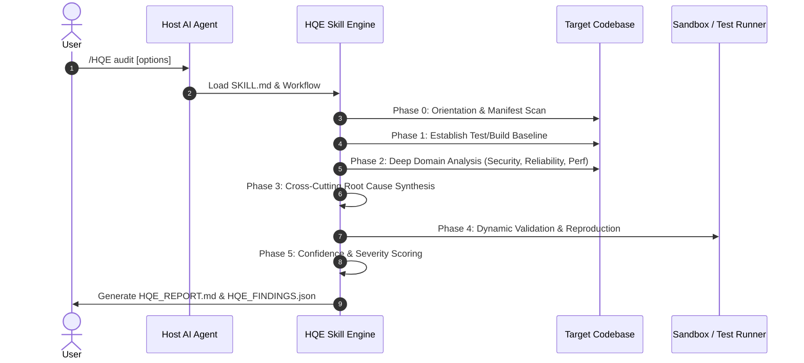

# HQE Skill Architecture & Design Specification

**Specification Version**: 1.0.0  
**Protocol Version**: HQE Protocol v4.2.1

---

## 1. System Philosophy

The **HQE (High Quality Engineering) Agent Skill** transforms any autonomous LLM agent into a principal-level software auditor, security analyst, and minimal-change remediation engineer.

Unlike traditional static analysis tools that generate hundreds of uncontextualized lint warnings, HQE uses deep reasoning, holistic architecture synthesis, and verifiable evidence gathering to uncover subtle logic defects, race conditions, security vulnerabilities, and design bottlenecks.

---

## 2. Structural Layering & Component Decomposition

The repository is structured around clear separation of responsibilities:

```
Skill-HQE/
├── SKILL.md                  <-- Root entrypoint, activation, and progressive disclosure routing
├── LICENSE                   <-- Apache-2.0 License
├── TERMS_OF_SERVICE.md       <-- Terms of Service & Acceptable Use Policy
├── PRIVACY.md                <-- Privacy & zero-telemetry policy
├── SECURITY.md               <-- Vulnerability disclosure policy
├── CODE_OF_CONDUCT.md        <-- Community code of conduct
├── CONTRIBUTING.md            <-- Developer contribution guidelines
├── README.md                 <-- Canonical project documentation
│
├── docs/                     <-- Architecture, security, threat models, guides
│   ├── ARCHITECTURE.md
│   ├── CAPABILITY_MAPPING.md
│   ├── DEVELOPER_GUIDE.md
│   ├── FINDING_SPECIFICATION.md
│   ├── SECURITY_MODEL.md
│   ├── THREAT_MODEL.md
│   └── USER_GUIDE.md
│
├── references/               <-- Conditional reference materials loaded dynamically
│   ├── audit-methodology.md
│   ├── evidence-standard.md
│   ├── large-repo-strategy.md
│   ├── prompt-injection-defense.md
│   ├── remediation.md
│   ├── repository-orientation.md
│   ├── security-review.md
│   ├── severity-confidence-effort.md
│   ├── verification.md
│   └── language-guides/      <-- Language-specific analysis guides
│       ├── go.md
│       ├── python.md
│       ├── rust.md
│       └── typescript-javascript.md
│
├── workflows/                <-- Step-by-step procedural playbooks
│   ├── full-audit.md
│   ├── handoff-generation.md
│   ├── pr-review.md
│   ├── remediation-run.md
│   └── targeted-bug-hunt.md
│
├── templates/                <-- Markdown output templates
│   ├── finding.md
│   ├── handoff.md
│   ├── report.md
│   └── run-manifest.md
│
├── schemas/                  <-- Draft-07 JSON schemas for machine-readable artifacts
│   ├── finding.schema.json
│   ├── findings.schema.json
│   ├── handoff.schema.json
│   └── run-manifest.schema.json
│
├── scripts/                  <-- Portable, standalone Python CLI helper tools
│   ├── check_skill.py
│   ├── detect_manifests.py
│   ├── inventory_repo.py
│   └── validate_findings.py
│
├── tests/                    <-- Test fixtures and schema test suite
│   ├── test_skill_suite.py
│   └── fixtures/
│
└── .github/workflows/        <-- CI/CD automated validation pipelines
    ├── ci.yml
    ├── security-scan.yml
    └── validate-skill.yml
```

---

## 3. Execution Pipeline & Phased Reasoning

When invoked via `/HQE`, the agent progresses through a strict multi-phase operational pipeline:



---

## 4. Progressive Disclosure Model

To optimize agent context window efficiency and prevent cognitive overload:
1. **Initial Load**: Only `SKILL.md` is loaded into context.
2. **Mode Resolution**: Based on user flags (e.g., `audit`, `security`, `remediate`, `pr-review`), the agent loads *only* the matching workflow from `workflows/`.
3. **Reference On-Demand**: Specialized references (`large-repo-strategy.md`, language guides) are read *only* if triggered by repository conditions.
