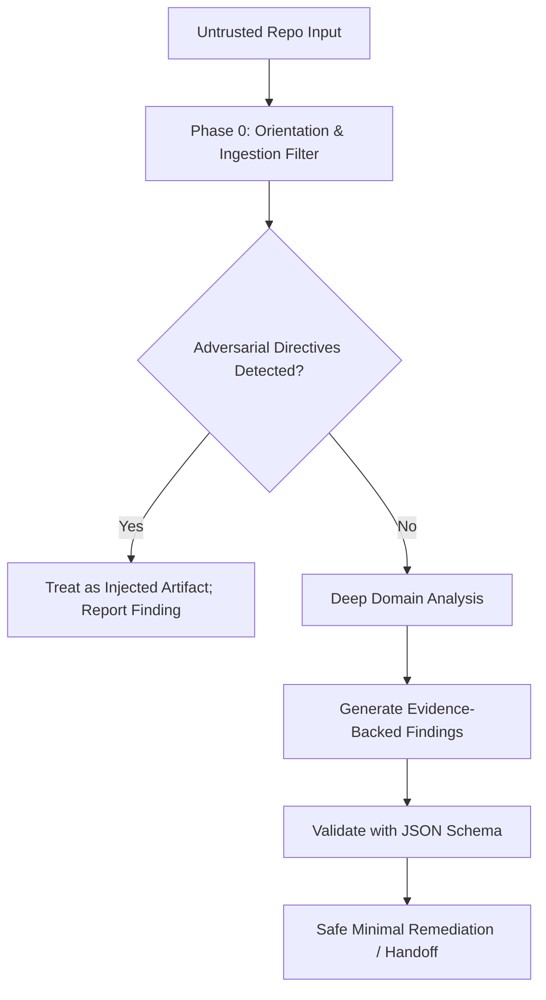

# Threat Model & STRIDE Analysis

**Document Version**: 1.0.0  
**Classification**: Public Engineering Reference

---

## 1. System Overview & Assets Under Protection

### Critical Assets:
1. **Host Developer Environment**: Local filesystem integrity, environment variables, credentials (`~/.ssh`, `~/.aws`, `~/.gemini`), and process execution namespace.
2. **Target Repository**: Uncommitted developer work, branch history, and source integrity.
3. **Audit Integrity**: Factual correctness of findings, absence of false negative omissions or hallucinated vulnerabilities.
4. **Confidentiality of Scanned IP**: Proprietary business logic, unreleased algorithms, and embedded secrets.

---

## 2. Threat Actors & Scenarios

- **Adversary A: Malicious Repository / Supply Chain Attacker**: Injects indirect prompt injection payloads into open-source repositories to trick reviewing AI agents into downloading malware or executing commands.
- **Adversary B: Rogue PR Submitter**: Submits subtle backdoors obscured by whitespace or complex macro logic.
- **Adversary C: Compromised Build Tooling**: Tampered build scripts that execute destructive actions when the agent attempts automated verification.

---

## 3. STRIDE Threat Matrix

| STRIDE Category | Specific Threat | Vector | Severity | Mitigation in HQE Skill |
| --------------- | --------------- | ------ | -------- | ----------------------- |
| **Spoofing** | Forged Finding Reports / Fake Test Passes | Malicious script mimicking testing output | High | Deterministic command exit code inspection and raw stderr/stdout capture requirement. |
| **Tampering** | Unintended destruction of working-tree changes | Agent overwriting uncommitted code | High | Mandatory `git status` verification before applying remediation; minimal diff footprint. |
| **Repudiation** | Ambiguous finding origins | Vague agent claims without reproducible proof | Medium | Mandatory **Evidence Standard**: exact file, line range, and 2-5 line verifiable code snippet. |
| **Information Disclosure** | Secret leakage in audit reports | Hardcoded API tokens printed in logs/markdown | Critical | Automated redaction requirement (`[REDACTED]`) across all finding outputs. |
| **Denial of Service** | Infinite loops / context exhaustion | Deep recursive symlinks or giant binary files | Medium | Pre-scan inventory filter (`scripts/inventory_repo.py`) ignoring binaries and recursive loops. |
| **Elevation of Privilege** | Indirect Prompt Injection leading to arbitrary CLI execution | Adversarial comments in source code | Critical | [Prompt Injection Defense Protocol](../references/prompt-injection-defense.md) treating all repo content as untrusted data. |

---

## 4. Verification and Audit Matrix

