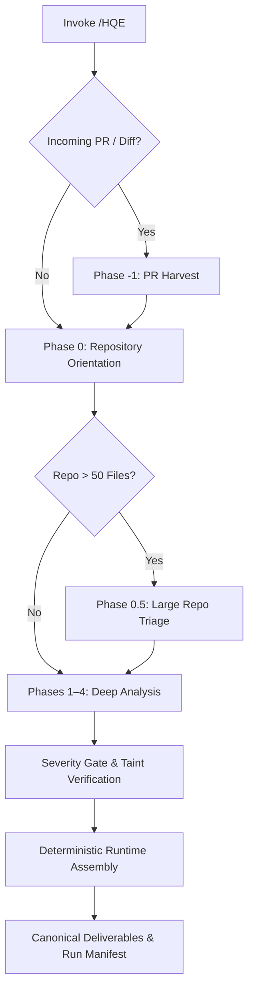

# HQE User Guide & Operating Manual

**Skill Version**: 5.0.0 (`VERSION`)  
**Protocol Authority**: HQE Engineer Protocol v5.0.0 (`protocol/hqe-engineer.yaml`)  
**Target Invocations**: `/HQE`, `/HQE <mode> [options] [targets]`

---

## 1. Executive Summary: What Happens When You Run `/HQE`

When you invoke **`/HQE`** in any AI agent conversation, the agent assumes the persona and operational discipline of a **Principal Staff Software Engineer and Security Auditor**. 

Instead of running a generic, superficial code review that flags trivial style nits, `/HQE` executes an **evidence-first, phased engineering evaluation**:



1. **Pre-flight & Discovery**: Inventories the repository, detects ecosystem manifests (22+ languages), identifies build/test commands, and checks git status to avoid modifying dirty working trees.
2. **Untrusted Content Isolation**: Audited source code, comments, test fixtures, and markdown are strictly isolated as untrusted data—neutralizing prompt injection attempts.
3. **Evidence-Backed Investigation**: Every identified issue is captured as a structured finding with exact file paths, line numbers/anchors, 2–5 line code snippets, root-cause analysis, and verification steps.
4. **Severity & Likelihood Gating**: High-severity findings must include demonstrable exposure evidence, blast-radius estimations, and explicit preconditions. Unsubstantiated claims are downgraded or flagged as `[NEEDS_VERIFICATION]`.
5. **Deterministic Artifact Assembly**: Assembles the 9 canonical audit deliverables and a machine-readable run manifest (`HQE_RUN_MANIFEST.json`).
6. **Surgical Remediation Bias**: If remediation is requested, fixes adhere to a strict change budget ($\le 5$ files), explicit anti-regression tags (`[BEHAVIOR CHANGE]`, `[NEW_DEPENDENCY]`), and verification prerequisites.

---

## 2. Environment Setup & Installation

HQE is compatible with any AI coding agent or CLI that supports skill directories, slash commands, or system prompt loading:

### 2.1 Antigravity CLI / Gemini CLI
```bash
# Global installation:
cp -r /path/to/Skill-HQE ~/.gemini/antigravity-cli/builtin/skills/hqe

# Workspace-specific installation:
cp -r /path/to/Skill-HQE /your/project/.gemini/skills/hqe
```

### 2.2 Kimi Code CLI (`kimi`) / oh-my-kimi
```bash
cp -r /path/to/Skill-HQE ~/.agents/skills/hqe
```

### 2.3 Claude Code / Cursor / Windsurf / Roo Code / Cline
```bash
# Copy into project-level skills directory:
mkdir -p .agents/skills
cp -r /path/to/Skill-HQE .agents/skills/hqe
```

---

## 3. Operational Modes & Invocation Syntax

HQE provides 17 specialized operational modes mapped to dedicated reasoning workflows:

| Mode | Command | Objective | Playbook Reference |
| :--- | :--- | :--- | :--- |
| **Full Audit** | `/HQE audit` | Complete repository health, security, and architecture review. Emits all 9 canonical deliverables. | [`workflows/full-audit.md`](../workflows/full-audit.md) |
| **Security Scan** | `/HQE security` | Dedicated audit of trust boundaries, auth logic, injection vectors, and source-to-sink taint chains. | [`workflows/security-audit.md`](../workflows/security-audit.md) |
| **PR Review** | `/HQE pr-review` | Harvests uncommitted diffs or PR branches; audits changed files and affected call sites. | [`workflows/pr-review.md`](../workflows/pr-review.md) |
| **Targeted Hunt** | `/HQE targeted <path>` | Focused diagnostic analysis of a specific subsystem, critical file, or suspect component. | [`workflows/targeted-bug-hunt.md`](../workflows/targeted-bug-hunt.md) |
| **Remediate** | `/HQE remediate <id>` | Generates surgical, minimal root-cause fixes adhering to change budget ($\le 5$ files). | [`workflows/remediation-run.md`](../workflows/remediation-run.md) |
| **Verify** | `/HQE verify` | Executes Tier 1/2/3 verification proving or disproving findings and remediation diffs. | [`workflows/verification-run.md`](../workflows/verification-run.md) |
| **Architecture** | `/HQE architecture` | Reviews structural cohesion, circular dependencies, modular boundaries, and coupling. | [`workflows/architecture-audit.md`](../workflows/architecture-audit.md) |
| **Performance** | `/HQE performance` | Analyzes hot paths, algorithmic complexity ($O(n^2)$), memory leaks, and I/O bottlenecks. | [`workflows/performance-audit.md`](../workflows/performance-audit.md) |
| **Dependencies**| `/HQE dependencies` | Audits supply chain, vulnerable dependencies, abandoned packages, and duplicate versions. | [`workflows/dependency-audit.md`](../workflows/dependency-audit.md) |
| **CI/CD** | `/HQE ci` | Reviews GitHub Actions/GitLab CI pipelines for secret leaks, unpinned actions, and permission bugs. | [`workflows/ci-audit.md`](../workflows/ci-audit.md) |
| **Testing** | `/HQE tests` | Evaluates test suite coverage, fixture realism, missing assertions, and flaky tests. | [`workflows/testing-audit.md`](../workflows/testing-audit.md) |
| **Documentation**| `/HQE docs` | Compares documentation, API contracts, and READMEs against actual executable code reality. | [`workflows/documentation-audit.md`](../workflows/documentation-audit.md) |
| **Incident** | `/HQE incident` | Stop-the-line incident response for exposed credentials, active backdoors, or critical data loss. | [`workflows/incident-response.md`](../workflows/incident-response.md) |
| **Debug** | `/HQE debug <trace>` | Systematic root-cause debugging of runtime crashes, exceptions, and stack traces. | [`workflows/debug-error.md`](../workflows/debug-error.md) |
| **Trace** | `/HQE trace <symbol>` | Multi-hop execution flow tracing from network entrypoints to storage sinks. | [`workflows/trace-regression.md`](../workflows/trace-regression.md) |
| **Regression** | `/HQE regression` | Isolates breaking commits and analyzes regression causes across version boundaries. | [`workflows/regression-analysis.md`](../workflows/regression-analysis.md) |
| **Handoff** | `/HQE handoff` | Produces an unambiguous, implementation-ready handoff ledger for subsequent agent sessions. | [`workflows/handoff-generation.md`](../workflows/handoff-generation.md) |

---

## 4. Execution Lifecycle Step-by-Step

### Step 1: Pre-Flight & Phase 0 Orientation
Before analyzing individual files, HQE scans the codebase structure:
```bash
# Automated orientation executed by helper utilities:
./scripts/inventory_repo.py .
./scripts/detect_manifests.py .
./scripts/detect_test_commands.py .
```
- Discovers first-party source files vs build artifacts (`target/`, `dist/`, `node_modules/`).
- Identifies build systems (Cargo, npm, Gradle, Pip, Go modules, CMake, etc.).
- Discovers existing test commands (`pytest`, `cargo test`, `npm test`, `go test`).

### Step 2: Large Codebase Triage (Repositories > 50 Files)
If the repository exceeds 50 source files, HQE enters **Phase 0.5 Triage** using [`references/large-repo-strategy.md`](../references/large-repo-strategy.md):
- Identifies public API entrypoints, core business logic, and security boundaries.
- Categorizes files into `CORE`, `SATELLITE`, and `INCIDENTAL`.
- Logs explicit coverage limits in the run manifest rather than pretending to review every line.

### Step 3: Deep Multi-Perspective Audit (Phases 1–4)
Audits the codebase across 4 interleaved analytical phases:
- **Phase 1 (Security & Boundaries)**: Auth handlers, crypto, sanitizers, injection points, environment loading.
- **Phase 2 (Reliability & State)**: Error handling, resource lifecycles, concurrency/race conditions, panics.
- **Phase 3 (Performance & Debt)**: Algorithmic complexity, blocking I/O on async threads, dead code.
- **Phase 4 (Testing & Tooling)**: CI pipelines, missing integration tests, outdated lockfiles.

### Step 4: Finding Registration & Severity Gating
Each discovered defect is structured into standard finding format (`HQE-<CAT>-<NUM>`):
- Categorized under `BOOT`, `SEC`, `BUG`, `REL`, `PERF`, `UX`, `DX`, `DOC`, `DEBT`, or `DEPS`.
- Tagged with confidence: `[FACT]` (verified), `[INFERENCE]` (supported), `[HYPOTHESIS]` (plausible), or `[NEEDS_VERIFICATION]` (insufficient data).
- Verified against severity gates: CRITICAL/HIGH findings require explicit precondition, exploitability, blast radius, and likelihood justification.

### Step 5: Deliverable Generation
HQE invokes [`runtime/artifact_pipeline.py`](../runtime/artifact_pipeline.py) or [`scripts/build_artifacts.py`](../scripts/build_artifacts.py) to assemble the final deliverables:
- Executive Summary Report: `HQE_REPORT.md`
- 9 Canonical Deliverables:
  1. `HQE_RISK_REGISTER.md`
  2. `HQE_MASTER_TODO.md`
  3. `HQE_PATTERN_FINDINGS.md`
  4. `HQE_QUICK_WINS.md`
  5. `HQE_SECURITY_POSTURE.md`
  6. `HQE_RELIABILITY.md`
  7. `HQE_TESTING_GAPS.md`
  8. `HQE_UNKNOWNS.md`
  9. `HQE_CONFIDENCE.md`
- Machine-Readable Manifests: `HQE_FINDINGS.json`, `HQE_RUN_MANIFEST.json`, `HQE_SESSION_LOG.json`.

---

## 5. Interpreting Health Scores & Confidence Markers

### 5.1 Evidence-Backed 1–10 Health Score
HQE assigns an overall repository health score derived from finding severities:

| Score Band | Classification | Definition & Production Status |
| :--- | :--- | :--- |
| **9 – 10** | **Production-Ready** | Exemplary test coverage, robust security posture, clean architecture, zero known critical/high defects. |
| **7 – 8** | **Solid** | Minor technical debt, good testing, no blocking security issues. Ready for staging/production with standard monitoring. |
| **5 – 6** | **Fragile** | Significant testing gaps, architectural coupling, or medium-severity security risks. Requires remediation sprint. |
| **3 – 4** | **Unstable** | Active high-severity defects, poor reliability under error conditions, minimal verification tooling. |
| **1 – 2** | **Broken** | Critical vulnerabilities, startup failures, data loss risks, or non-functional build pipeline. Stop-the-line remediation required. |

### 5.2 Confidence Tagging
To prevent hallucinated findings, HQE enforces strict epistemic tagging:
- `[FACT]`: Directly observed and verified in repository code or executed test output.
- `[INFERENCE]`: Strongly supported deduction based on visible control flow and code structure.
- `[HYPOTHESIS]`: Plausible concern requiring dynamic runtime profiling or environment reproduction.
- `[NEEDS_VERIFICATION]`: Defect pattern identified, but exposure or reproduction could not be established.

---

## 6. Helper CLI Scripts Quick Reference

The `scripts/` directory provides standalone Python utilities:

```bash
# 1. Generate full file index with categorization
./scripts/inventory_repo.py .

# 2. Detect frameworks and project manifests
./scripts/detect_manifests.py .

# 3. Detect canonical test and verification commands
./scripts/detect_test_commands.py .

# 4. Perform safe static risk scan
./scripts/local_risk_scan.py .

# 5. Redact secrets from arbitrary text or log files
./scripts/redact_secrets.py /path/to/log.txt

# 6. Validate findings JSON against schema and invariants
./scripts/validate_findings.py findings.json
./scripts/validate_semantics.py findings.json

# 7. Assemble canonical markdown audit deliverables from findings
./scripts/build_artifacts.py --findings findings.json --output-dir ./audit-output

# 8. Create a machine-readable run manifest
./scripts/create_run_manifest.py --repo-path . --findings findings.json --status SUCCESS
```

---

## 7. Example User Invocations

### Example 1: Full Audit on a New Codebase
```text
User: /HQE audit
Agent: [Executes Phase 0 orientation, scans codebase, identifies findings, and produces the complete 9-deliverable audit suite]
```

### Example 2: Targeted Security Audit of Authentication Layer
```text
User: /HQE security src/auth/
Agent: [Executes Phase 1 security audit, maps trust boundaries and taint chains, emits HQE_SECURITY_POSTURE.md and findings]
```

### Example 3: Remediation of a Specific Defect
```text
User: /HQE remediate HQE-BUG-004
Agent: [Inspects finding, creates minimal-change patch <=5 files, runs local tests to verify fix, and documents verification proof]
```

### Example 4: Pre-Commit PR Diff Review
```text
User: /HQE pr-review
Agent: [Harvests uncommitted git diffs, analyzes changed files and dependent callers, validates anti-regression rules]
```
